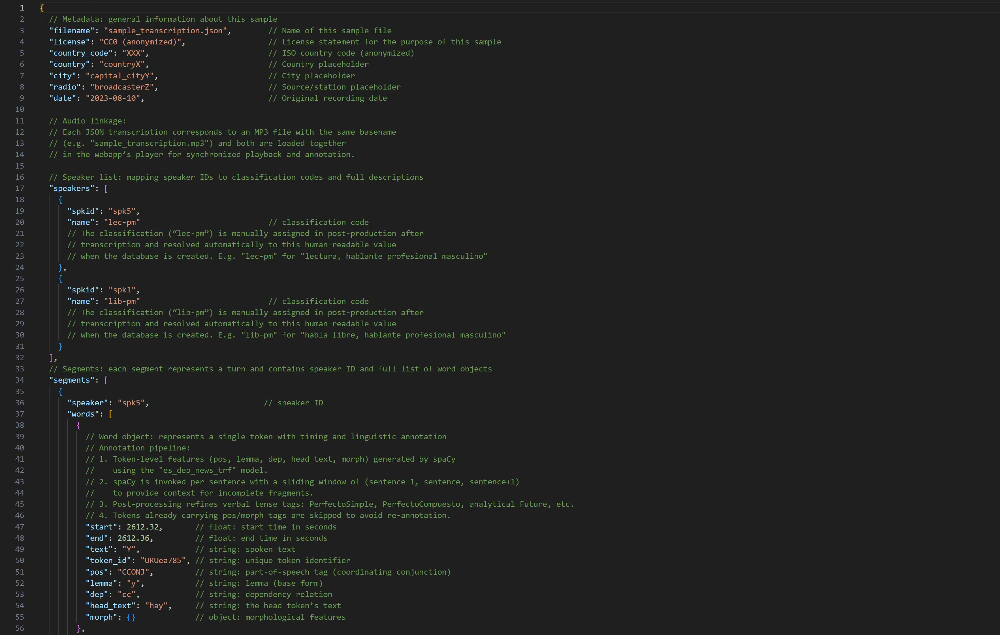
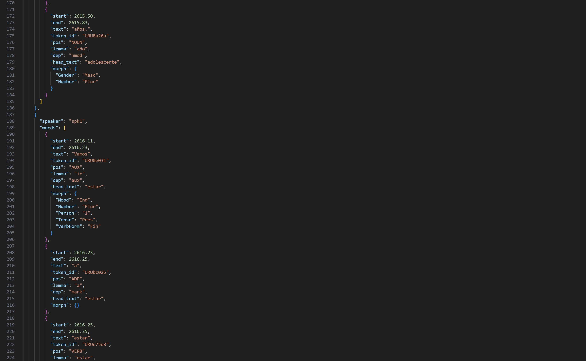

**CO.RA.PAN** significa “Corpus Radiofónico Panhispánico”. Se trata de un extenso proyecto de corpus para la investigación sistemática de la pluricentricidad del español a partir de la lengua estándar hablada. Reúne cerca de 1,5 millones de palabras extraídas de los informativos de las emisoras principales de casi todos los países hispanohablantes (excepto Guinea Ecuatorial), con al menos seis horas de audio por país. Los datos de audio se han transcrito mediante métodos asistidos por IA, se han anotado lingüísticamente (por ejemplo, tipo de hablante, situación de habla) y se han preparado en una base de datos relacional para su consulta. Por primera vez, se dispone de datos de investigación de alta calidad y comparables para toda la Hispanofonía.

[Ir al Corpus en línea <i class="fa-solid fa-up-right-from-square"></i>](https://corapan.online.uni-marburg.de){.md-button .md-button--primary target="_blank" rel="noopener noreferrer"}  

---

### 1. Aplicación web (Código y documentación)

A través de la aplicación web, las personas usuarias pueden, cómodamente desde el navegador:

- reproducir las emisiones radiofónicas en un reproductor con transcripción sincronizada  
- buscar fragmentos concretos mediante un motor de búsqueda interno  
- filtrar resultados por país, emisora, tipo de hablante y situación de habla  
- descargar fragmentos de audio y generar espectrogramas  

**Screenshots (Webapp)**

Todo el código de la aplicación se gestiona en un repositorio seguro en la nube y se archiva automáticamente en cada nueva versión. Así, se obtiene para cada release un enlace DOI permanente, que puede citarse en publicaciones.  

{target="_blank" rel="noopener noreferrer"}
  

---

### 2. Full Corpus (Restringido)

El corpus completo incluye las 1,5 millones de palabras con archivos de audio originales, transcripciones revisadas y anotaciones exhaustivas. En Zenodo se muestran públicamente los metadatos, mientras que los datos en sí están protegidos (“Restricted”) por derechos de autor y solo se facilitan tras evaluación de la solicitud. Este modelo de acceso diferenciado garantiza la disponibilidad a largo plazo y la protección de contenidos sensibles.  

  

---

### 3. Sample Corpus (Público)

Debido a restricciones de derechos de autor, no podemos ofrecer el corpus completo de forma abierta. En su lugar, proporcionamos una muestra de las transcripciones que ilustra de forma totalmente transparente la estructura de datos, la alta calidad del procesamiento y los pasos de anotación. Investigadores e investigadoras pueden así comprobar de inmediato cómo están organizados los audios, las transcripciones y las anotaciones, sin esperar a autorizaciones.  

**Screenshots (Sample Corpus)**

---

Todos los artefactos cuentan con DOI únicos y siguen los **principios FAIR** para asegurar reutilización, interoperabilidad y visibilidad.  

{target="_blank" rel="noopener noreferrer"}

