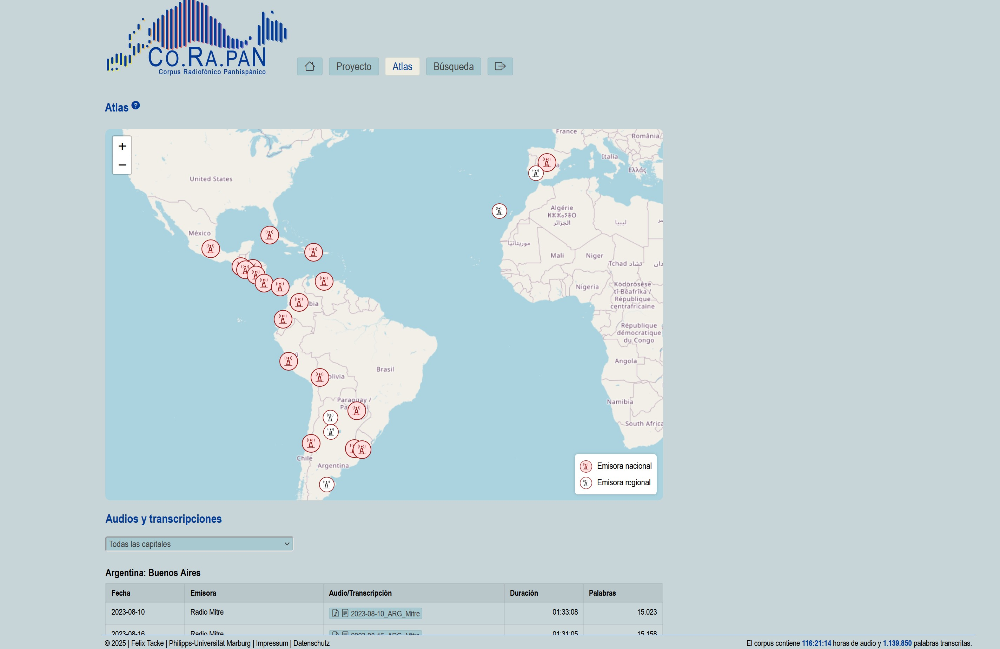
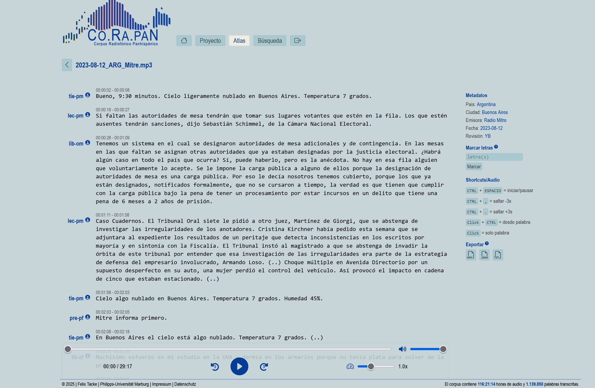
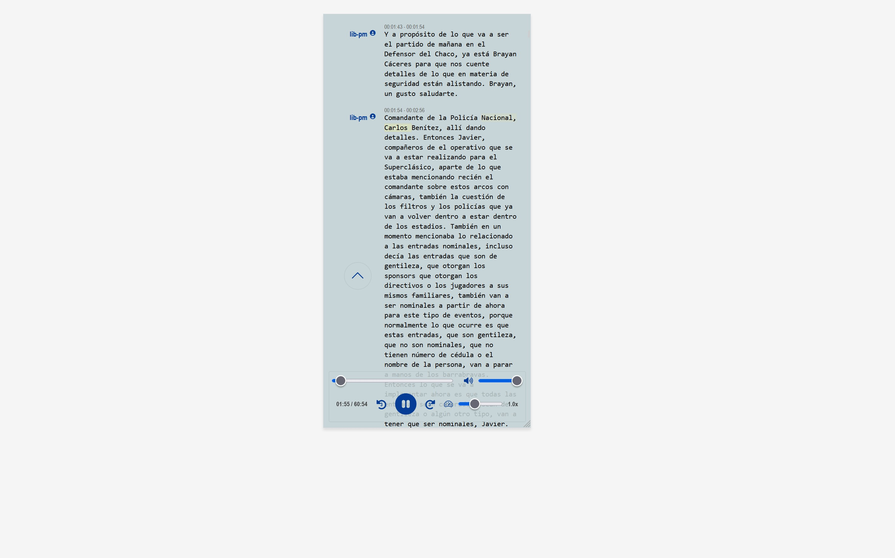

**CO.RA.PAN** steht für "Corpus Radiofónico Panhispánico". Es handelt sich um ein umfangreiches Korpusprojekt zur systematischen Erforschung der Plurizentrik des Spanischen anhand von gesprochener Standardsprache. Es vereint knapp 1,5 Mio. Wörter aus Nachrichtensendungen der Hauptstadt-Sender aus fast allen hispanophonen Ländern (Ausnahme Äquatorialguinea), jeweils mit mindestens sechs Stunden Audio pro Land. Die Audiodaten wurden mithilfe KI-gestützter Verfahren transkribiert, linguistisch annotiert (z. B. Sprechertyp, Redesituation) und in einer relationalen Datenbank durchsuchbar aufbereitet. Damit stehen erstmals hochqualitative, vergleichbare Forschungsdaten zur gesamten Hispanophonie zur Verfügung.

---

---

[Zum Online-Korpus <i class="fa-solid fa-up-right-from-square"></i>](https://corapan.online.uni-marburg.de){.md-button .md-button--secondary target="_blank" rel="noopener noreferrer"}

### 1. Web-App (Code & Dokumentation)

Über die Web-App können Nutzer:innen bequem im Browser:

- Radiosendungen im Player mit synchronisierter Transkription wiedergeben
- über eine Suchmaschine konkrete Äußerungen finden
- Ergebnisse nach Ländern, Sendern, Sprechertypen und Redesituationen filtern
- Audio-Snippets herunterladen und Spektrogramme erzeugen
 
Unser gesamter Anwendungs­code wird in einem sicheren, cloud­basierten Repository verwaltet und bei jedem neuen Release automatisch archiviert. So erhalten Sie zu jeder Version einen dauerhaften DOI–Link, der in Publikationen zitiert werden kann. Hinter den Kulissen sorgt eine vollautomatische Pipeline dafür, dass neue Funktionen geprüft, dokumentiert und langfristig verfügbar gemacht werden – ganz ohne technisches Fachwissen.

{target="_blank" rel="noopener noreferrer"}
  

### 2. Full Corpus (Restricted)  
Das vollständige Korpus umfasst alle 1,5 Mio. Wörter mit originalen Audiodateien, überarbeiteten Transkriptionen und umfassenden Annotationen. In Zenodo werden Metadaten öffentlich angezeigt, während die Daten selbst aufgrund des Urheberrechts geschützt („Restricted“) sind und nur nach Prüfung freigegeben werden können. Dieses differenzierte Zugangsmodell sichert langfristige Verfügbarkeit und Datenschutz sensibler Inhalte.

### 3. Sample Corpus (Public)  
Aufgrund der urheberrechtlichen Beschränkungen können wir das vollständige Korpus nicht frei zugänglich machen. Stattdessen bieten wir ein kompaktes Sample mit ausgewählten Transkriptionen und Audio-Clips an, das die Datenstruktur, die hohe Qualität der Aufbereitung und die annotatorischen Schritte vollständig transparent darstellt. Forscher:innen und Interessierte können so prüfen, wie Audiodaten, Transkriptionen und Annotationen aufgebaut sind, ohne auf Zugriffsfreigaben warten zu müssen.  

  

Alle drei Artefakte sind über eindeutige DOIs zitierbar und folgen den **FAIR-Prinzipien**, um Nachnutzbarkeit, Interoperabilität und Sichtbarkeit sicherzustellen.  
