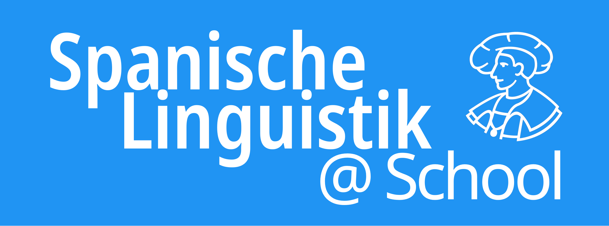

# ¡Bienvenid@!

{width=400px}

En **Hispanística** se presenta una visión general de los distintos proyectos de Humanidades Digitales en el ámbito de la lingüística hispánica en la Universidad Philipps de Marburgo, bajo la dirección del [Profesor Felix Tacke](https://www.uni-marburg.de/de/fb10/romanistik/institut/ordner_lehrende/felix-tacke){target="_blank" rel="noopener noreferrer"}.

###[CO.RA.PAN (Corpus Radiofónico Panhispánico)](corapan.md)  
[{width=400px}](corapan.md)  
  
Proyecto de corpus con aprox. 1,4 millones de palabras procedentes de noticieros de casi todos los países hispanohablantes, que permite por primera vez una investigación sistemática sobre la pluricentricidad del español. El proyecto combina la recopilación y el procesamiento de datos lingüísticos de alta calidad con una aplicación web que facilita el acceso a las transcripciones corregidas, los datos lingüísticos anotados y los archivos de audio. [Saber más...](corapan.md)

###[MAR.ELE](marele.md)  
[{width=400px}](marele.md)  
  
Corpus para el estudio de la pronunciación del español como lengua extranjera, basado en grabaciones de estudiantes de español de distintos niveles de competencia. La aplicación web desarrollada específicamente permite acceder a las grabaciones completas, a información sociodemográfica y a un análisis comparativo de segmentos de audio. [Saber más...](marele.md)

###[Spanische Linguistik @ School](spanisch-toolkit.md)  
[{width=400px}](spanisch-toolkit.md)  
  
Libro digital dirigido a docentes de español, con introducciones accesibles a temas clave de la lingüística hispánica. El libro se desarrolla colaborativamente con estudiantes en el marco de un proyecto docente y se amplía de forma continua. [Saber más...](spanisch-toolkit.md)

## La idea detrás

La disponibilidad de modelos de lenguaje de gran escala (LLMs) y de inteligencia artificial generativa ha abierto recientemente nuevas posibilidades para las humanidades: procesar, analizar y publicar datos de investigación de forma digital. Esto permite desarrollar herramientas específicas incluso sin una infraestructura informática costosa, facilitando el acceso a los datos tanto para la investigación como para la docencia universitaria y la transferencia al ámbito escolar.

Nuestro enfoque se inspira en el espíritu del código abierto y pretende también aportar a la comunidad. Por ello, todo el código fuente de nuestros proyectos, junto con una documentación detallada, está disponible en GitHub:

{target="_blank" rel="noopener noreferrer"}
{target="_blank" rel="noopener noreferrer"}  