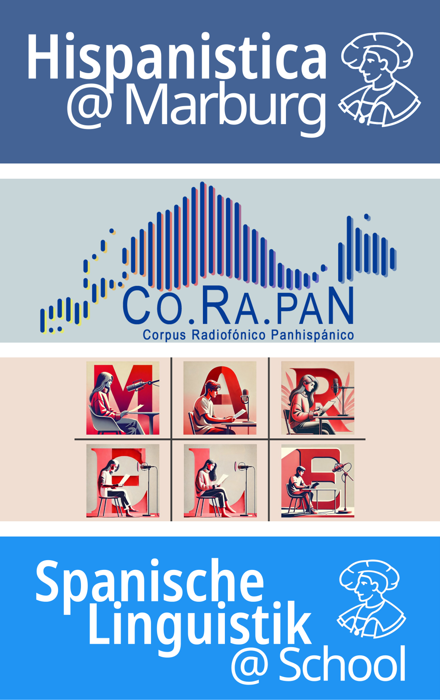

# Willkommen!

  

Auf **Hispanistica** finden Sie einen Überblick über die verschiedenen Digital Humanities-Projekte der hispanistischen Sprachwissenschaft an der Philipps-Universität Marburg unter der Leitung von Prof. Dr. Felix Tacke.

[CO.RA.PAN (Corpus Radiofónico Panhispánico)](corapan.md)  
Korpusprojekt mit 1,5 Mio. Wörtern aus Nachrichtensendungen aus fast allen hispanophonen Ländern, das erstmals die systematische Erforschung der Plurizentrik des Spanischen ermöglicht. Das Projekt setzt sich zusammen aus der Sammlung und Aufbereitung hochqualitativer Forschungsdaten sowie der Bereitstellung eines benutzerfreundlichen Zugangs über eine Webapp, welche den Zugriff auf die aufbereiteten Transkriptionen, annotierten sprachlichen Daten und die Audiodaten ermöglicht.

[MAR.ELE](marele.md)  
Korpus zur Erforschung der Aussprache des Spanischen als Fremdsprache auf Basis von Audioaufnahmen die mit Spanischstudierenden unterschiedlicher Sprachniveaus durchgeführt wurden. Die eigens programmierte Webapp bietet Zugang zu den vollständigen Aufnahmen, soziodemografischen Angaben und ermöglicht die vergleichende Analyse von Audiosegmenten.

[Spanische Linguistik @ School](spanisch-toolkit.md)  
Digitales Sachbuch für Spanischlehrkräfte mit verständlichen Einführungen in zentrale sprachwissenschaftliche Themen. Das Buch wird im Rahmen eines Lehrprojektes kollaborativ mit Studierenden entwickelt und kontinuierlich erweitert.   

## Die Idee dahinter

Durch die Verfügbarkeit von Large Language Models (LLMs) und generativer KI eröffnen sich den Geisteswissenschaften in jüngster Zeit völlig neue Möglichkeiten, Forschungsdaten digital zu verarbeiten, zu analysieren und zu publizieren. Dadurch wird es immer leichter, auch ohne eine teure IT-Infrastruktur maßgeschneiderte Tools zu schaffen, die den Zugang zu unseren Forschungsdaten nicht nur für die Forschungsgemeinschaft erleichtern, sondern deren Nutzung insbesondere auch für die universitäre Lehre und den Transfer in den Schulunterricht zu fördern.

Unser Ansatz profitiert vom Open-Source-Gedanken und möchte selbst Impulse zurückgeben. Den gesamten Quellcode unserer Projekte einschließlich ausführlicher Dokumentation finden Sie daher auf GitHub:

{target="_blank" rel="noopener noreferrer"}