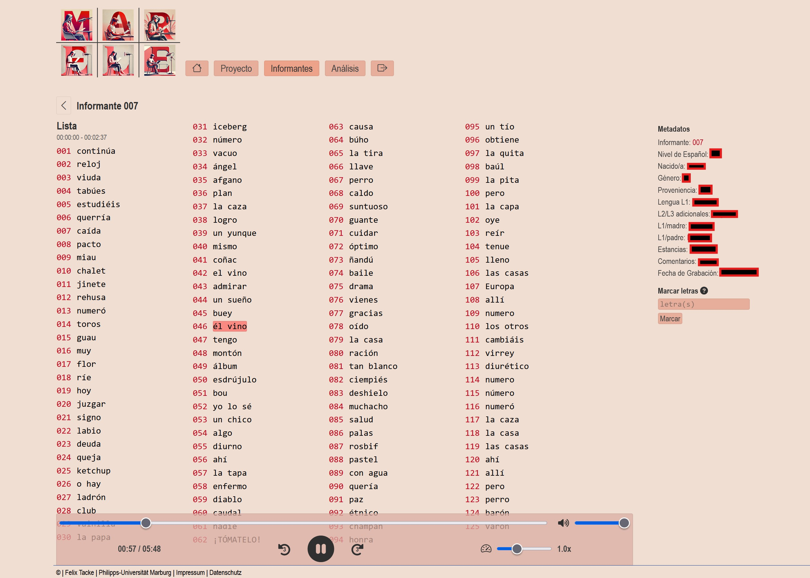
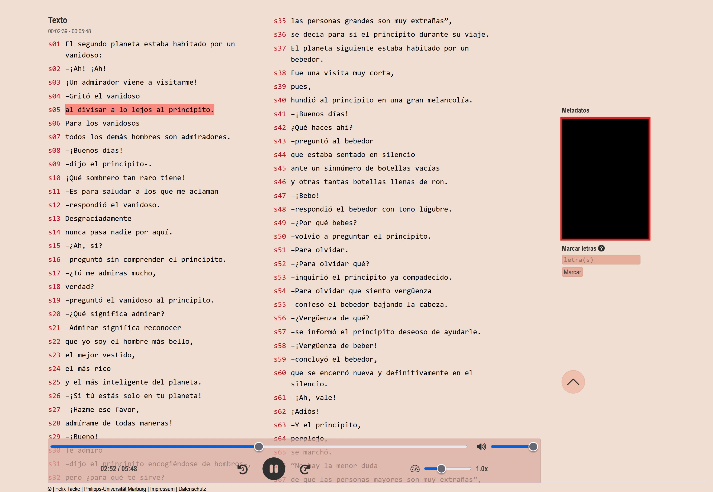
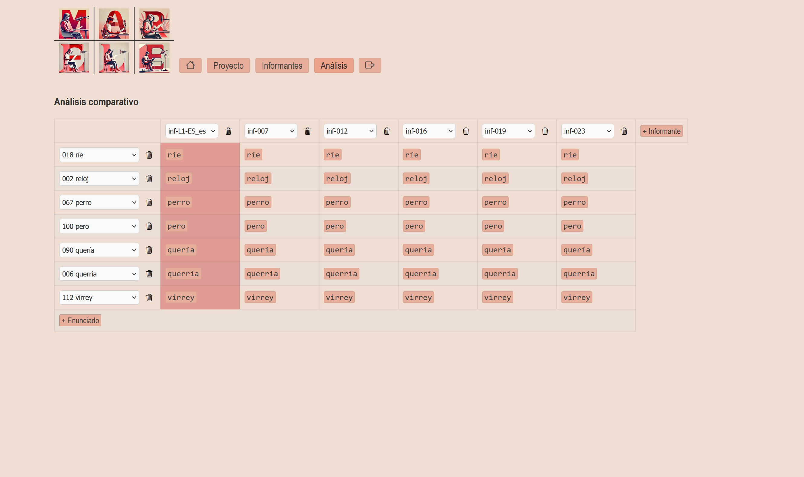

**MAR.ELE** es un proyecto de corpus para el estudio de la pronunciación del español como lengua extranjera. Se basa en grabaciones de estudiantes de la Universidad de Marburg que leyeron tanto un texto continuo como una lista controlada de palabras (cf. proyecto FEC[^1]). Este corpus, en constante crecimiento, se publica con fines lingüísticos y didácticos, y permite por primera vez estudios empíricos sistemáticos sobre dificultades, retos y procesos de desarrollo en la competencia de pronunciación de l@s aprendientes.

El proyecto combina la recopilación y el tratamiento de datos de investigación de alta calidad con el acceso a través de una aplicación web fácil de usar. Dicha aplicación no solo ofrece las grabaciones completas de cada participante junto con sus datos sociodemográficos, sino que también permite escuchar de forma selectiva y comparativa palabras y segmentos de frase. Así, MAR.ELE es útil tanto en la enseñanza universitaria como en la instrucción escolar de español.

[Ir a la Web-App <i class="fa-solid fa-up-right-from-square"></i>](https://marele.online.uni-marburg.de/){.md-button .md-button--primary target="_blank" rel="noopener noreferrer"}

---

### 1. Web-App (Código y documentación)

En el navegador, la aplicación web permite:

- reproducir las grabaciones completas de cada participante con transcripción sincronizada  
- consultar los datos sociodemográficos en la sección **“Informantes”**  
- comparar y escuchar palabras y pasajes de texto en **“Análisis”**  
- descargar fragmentos de audio  

---
**Screenshots (Webapp)**

---

El código fuente está disponible como una aplicación Python-Flask containerizada con Docker y con integración CI/CD. Cada versión recibe automáticamente un DOI en Zenodo, garantizando su citabilidad permanente.

{target="_blank" rel="noopener noreferrer"}  

---

### 2. Full Corpus (Restringido)

El corpus completo de MAR.ELE incluye todas las grabaciones de audio y las transcripciones con anotaciones y metadatos. Por requisitos de protección de datos (grabaciones de voz seudonimizadas), los archivos están en estado **“Restricted”** y solo se accede a ellos previa solicitud por escrito, mientras que los metadatos permanecen accesibles públicamente.

---

Todos los artefactos cuentan con DOIs únicos y siguen los principios FAIR para asegurar su reutilización, interoperabilidad y visibilidad.

[^1]: Pustka, E., Gabriel, C., Meisenburg, T., Burkard, M. y Dziallas, K. (2018). “(Inter-)Fonología del Español Contemporáneo (I)FEC: Methodology of a research program for corpus phonology”, *Loquens*, 5(1): e046.