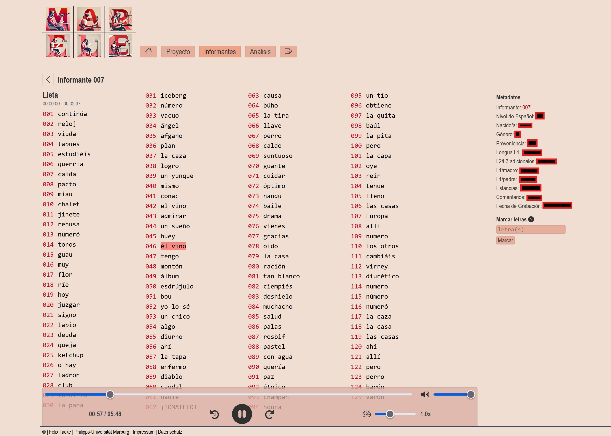
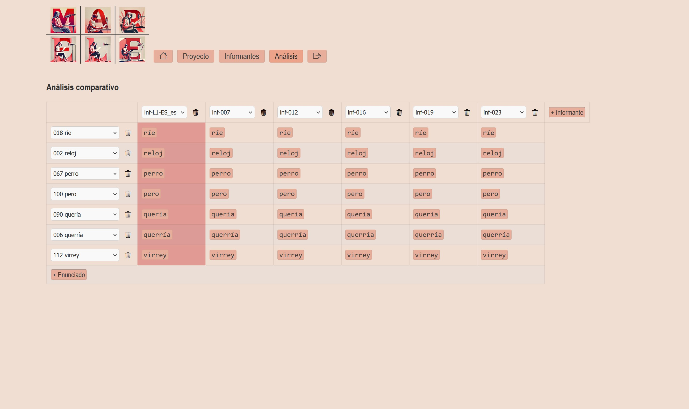

**MAR.ELE** ist ein Korpusprojekt zur Erforschung der Aussprache des Spanischen als Fremdsprache. Es basiert auf Audio­aufnahmen von Studierenden der Universität Marburg, die sowohl einen fortlaufenden Lesetext als auch eine kontrollierte Wortliste (vgl. FEC-Projekt[^1]) eingelesen haben. Das kontinuierlich wachsende Korpus wird zu linguistischen und didaktischen Zwecken veröffentlicht und ermöglicht erstmals systematische empirische Studien zu Schwierigkeiten, Herausforderungen und Entwicklungsprozessen in der Aussprachekompetenz von Lernenden.

Das Projekt setzt sich zusammen aus der Sammlung und Aufbereitung hochqualitativer Forschungsdaten sowie der Bereitstellung eines benutzerfreundlichen Zugangs über eine Webapp. Diese stellt nicht nur die vollständigen Aufnahmen einzelner Sprecher:innen und ihre soziodemografischen Angaben zur Verfügung, sondern erlaubt auch das gezielte und vergleichende Anhören einzelner Wörter und Satzsegmente. Damit eignet sich MAR.ELE gleichermaßen für universitäre Lehre und den schulischen Spanischunterricht.

[Zur Web-App <i class="fa-solid fa-up-right-from-square"></i>](https://marele.online.uni-marburg.de/){.md-button .md-button--primary target="_blank" rel="noopener noreferrer"}

---

### 1. Web-App (Code & Dokumentation)

Über die Web-App im Browser lassen sich:

- komplette Aufnahmen jeder Teilnehmer:in mit synchronisierter Transkription abspielen  
- unter **„Informant:innen“** soziodemografische Daten einsehen  
- unter **„Analyse“** einzelne Wörter und Textpassagen vergleichen  
- Audio-Snippets herunterladen  

---
**Screenshots (Webapp)**

---

Der Quellcode ist als Docker-containerisierte Python-Flask-Anwendung mit CI/CD-Pipeline verfügbar. Jede Version erhält automatisch einen DOI auf Zenodo und bleibt so dauerhaft zitierbar.  

{target="_blank" rel="noopener noreferrer"}

---

### 2. Full Corpus (Restricted)

Das vollständige MAR.ELE-Korpus umfasst alle Audio- und Transkriptionsdaten mit Annotationen und Metadaten. Aufgrund datenschutzrechtlicher Vorgaben (personenbezogene pseudonymisierte Sprachaufnahmen) sind die Dateien auf **„Restricted“** gesetzt und nur nach schriftlicher Anfrage zugänglich, während alle Metadaten öffentlich einsehbar bleiben.  

---

Alle Artefakte sind über eindeutige DOIs zitierbar und folgen den FAIR-Prinzipien, um Nachnutzbarkeit, Interoperabilität und Sichtbarkeit sicherzustellen.

{target="_blank" rel="noopener noreferrer"}

[^1]: Pustka, E., Gabriel, C., Meisenburg, T., Burkard, M. and Dziallas, K. (2018) “(Inter-)Fonología del Español Contemporáneo (I)FEC: Methodology of a research program for corpus phonology”, Loquens, 5(1), p. e046. doi: /loquens.2018.046.