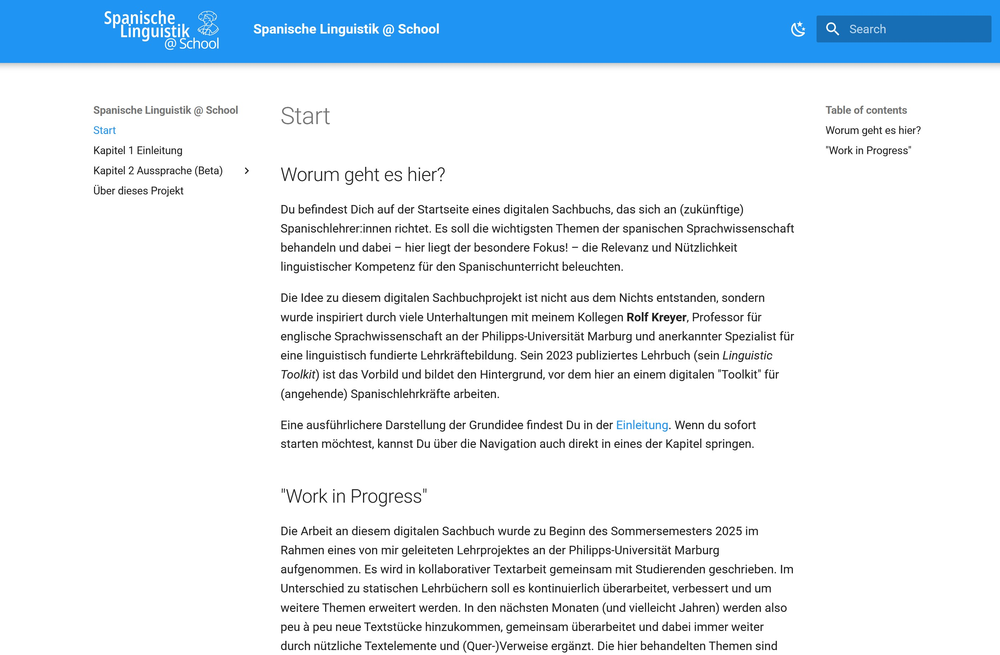

**Lingüística Española @ School** es un libro digital para docentes (en formación) de español. Presenta de forma comprensible temas centrales de la lingüística del español y muestra cómo las competencias lingüísticas pueden enriquecer la enseñanza de lenguas extranjeras.
El proyecto se inspira en el *Linguistic Toolkit for Teachers of English* de Prof. Dr. Rolf Kreyer (2023) y se desarrolla desde el semestre de verano de 2025 como parte de un proyecto docente en la Universidad Philipps de Marburgo; se redacta de forma colaborativa con estudiantes y seguirá ampliándose de manera continua.

El libro digital “Lingüística Española @ School” está implementado como sitio web estático con MkDocs y utiliza el tema “Material for MkDocs” para un diseño moderno y responsivo que ofrece una visualización optimizada e interacción intuitiva, especialmente en dispositivos móviles.

[Acceder al libro digital <i class="fa-solid fa-up-right-from-square"></i>](https://linguistik.online.uni-marburg.de/){.md-button .md-button--primary target="_blank" rel="noopener noreferrer"}

---

## OER y código abierto: uso y desarrollo abiertos

Este proyecto es un **Recurso Educativo Abierto (OER)**.  
Los **contenidos** pueden usarse, adaptarse y compartirse libremente bajo **CC BY-SA 4.0** (obligatorio: atribución, enlace a la licencia e indicación de cambios).  
El **código** se basa en *Material for MkDocs* y se publica con **licencia MIT**. Lo hemos ampliado para representar mejor un libro digital con contenidos multimedia (p. ej., mejor integración de audio, portada/cubierta, optimizaciones de exportación).  
Para crear tu propia derivación: haz un fork del repositorio → adapta los contenidos en `docs/` → configura `mkdocs.yml` → publica en **GitHub Pages** o en tu propio servidor.  

El código fuente está disponible en un [repositorio público de GitHub](https://github.com/FTacke/spanisch-toolkit){target="_blank" rel="noopener noreferrer"}, y el proyecto está archivado en Zenodo con un [DOI](https://doi.org/10.5281/zenodo.15348687){target="_blank" rel="noopener noreferrer"} para garantizar su citabilidad permanente.  

---

**Capturas de pantalla**

---

{target="_blank" rel="noopener noreferrer"}
{target="_blank" rel="noopener noreferrer"}  
{target="_blank" rel="noopener noreferrer"}
{target="_blank" rel="noopener noreferrer"}
{target="_blank" rel="noopener noreferrer"}
{target="_blank" rel="noopener noreferrer"}
