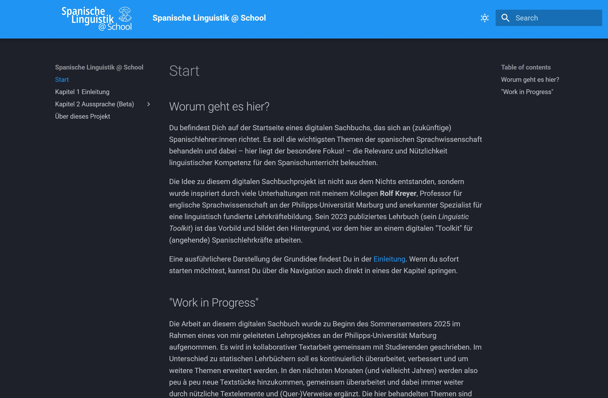
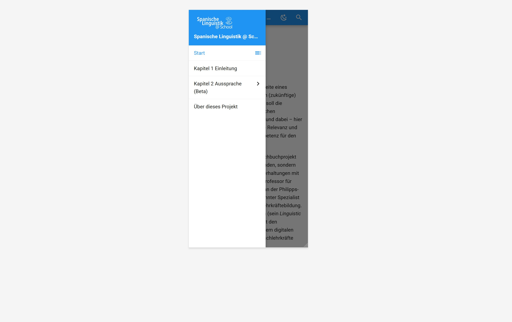
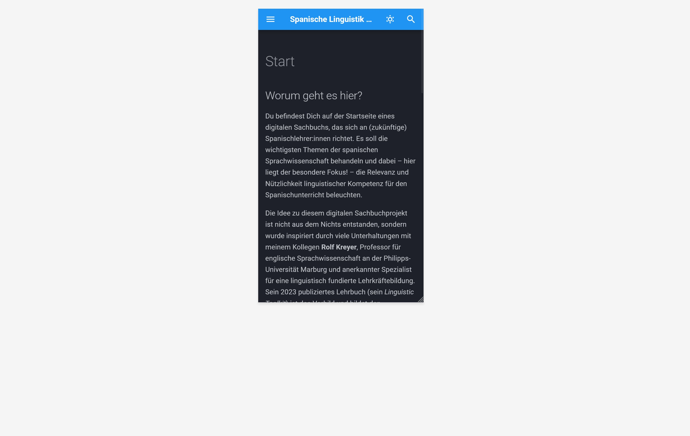

**Spanische Linguistik @ School** ist ein digitales Sachbuch für (angehende) Spanischlehrkräfte. Es bereitet zentrale Themen der spanischen Sprachwissenschaft verständlich auf und zeigt, wie linguistische Kompetenzen den Fremdsprachenunterricht bereichern können.
Das Projekt wurde inspiriert vom *Linguistic Toolkit for Teachers of English* von Prof. Dr. Rolf Kreyer (2023) und entsteht seit dem Sommersemester 2025 im Rahmen eines Lehrprojekts an der Philipps-Universität Marburg – es wird gemeinsam mit Studierenden kollaborativ geschrieben und soll auch kontinuierlich weiterentwickelt werden.

Das digitale Sachbuch „Spanische Linguistik @ School“ ist als statische Website mit MkDocs umgesetzt und nutzt das „Material for MkDocs“-Theme für ein modernes, responsives Design, das insbesondere auf mobilen Endgeräten eine optimierte Darstellung und intuitive Navigation bietet.

[Zum digitalen Sachbuch <i class="fa-solid fa-up-right-from-square"></i>](https://ftacke.github.io/spanisch-toolkit/){.md-button .md-button--secondary target="_blank" rel="noopener noreferrer"}

---
#### Screenshots

---

Der Quellcode liegt in einem öffentlichen [GitHub-Repository](https://github.com/FTacke/spanisch-toolkit), und das Projekt ist auf Zenodo unter einem [DOI](https://doi.org/10.5281/zenodo.15348687) archiviert, um eine dauerhafte Zitierfähigkeit sicherzustellen. Dieses Projekt steht unter der Creative Commons Lizenz CC BY-NC 4.0.

{target="_blank" rel="noopener noreferrer"}
{target="_blank" rel="noopener noreferrer"}
{target="_blank" rel="noopener noreferrer"}
{target="_blank" rel="noopener noreferrer"}

